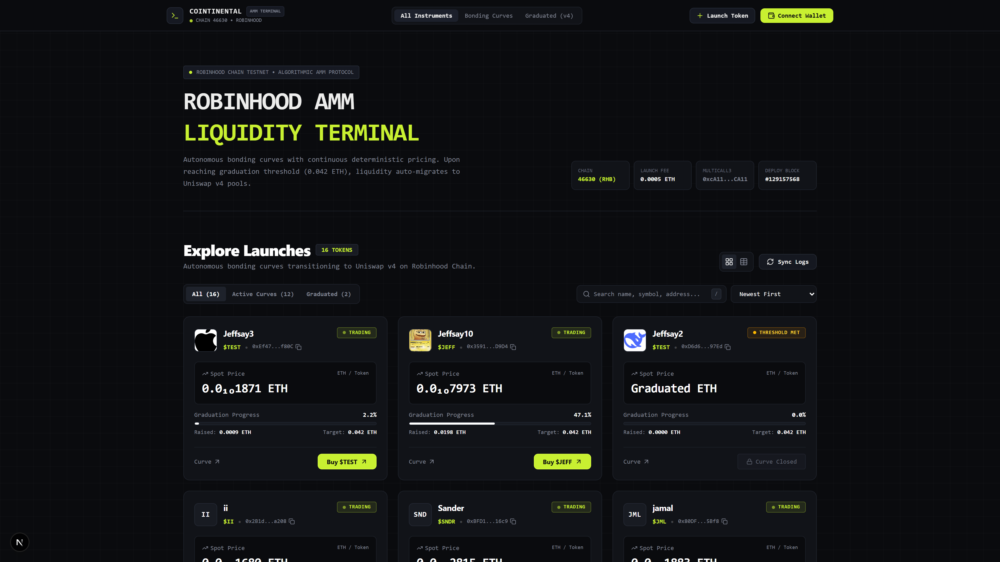
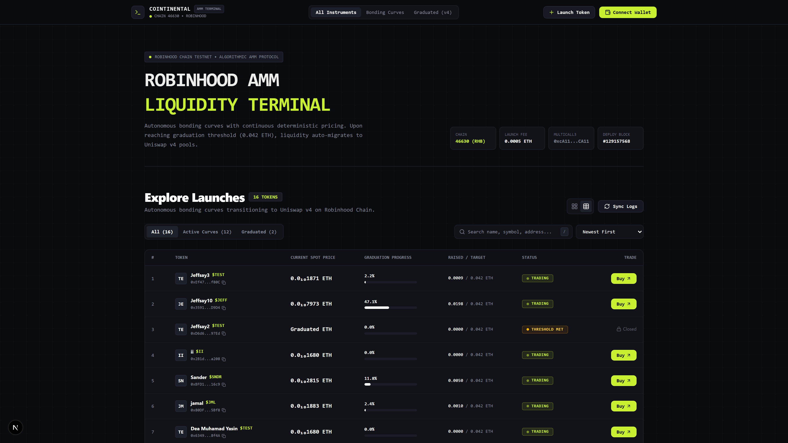
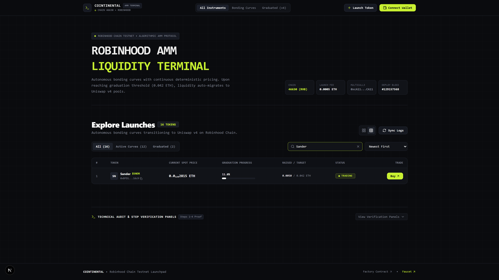
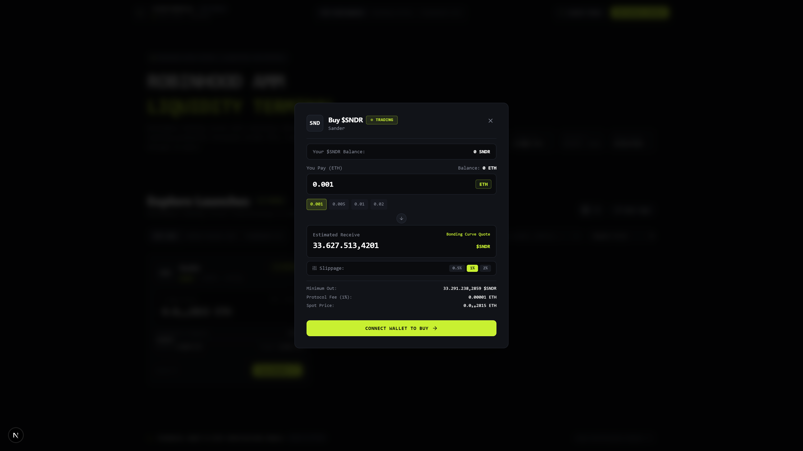
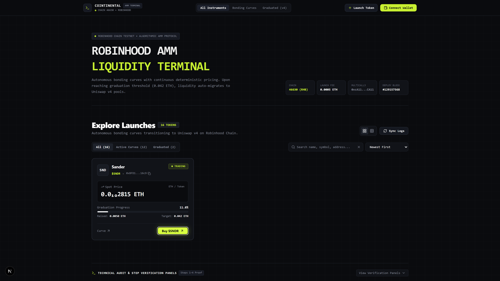
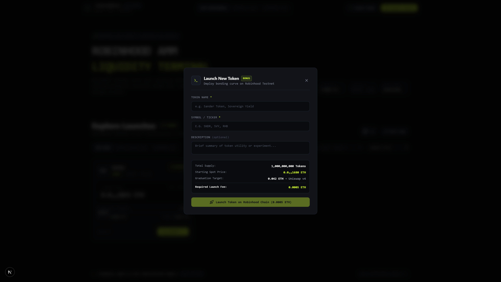
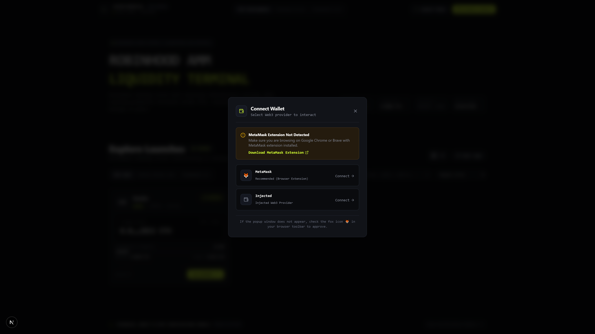
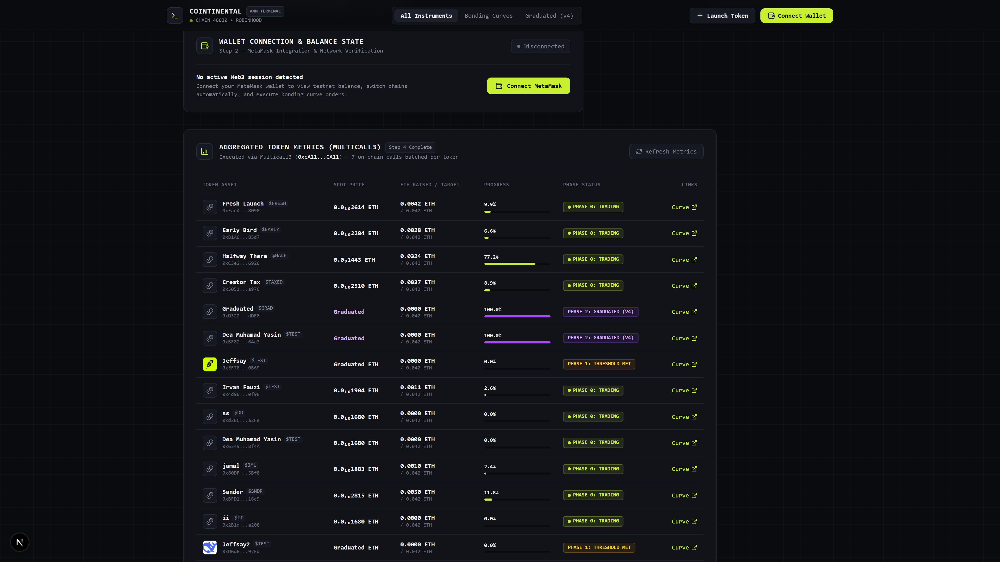

# COINTINENTAL — Algorithmic AMM Terminal & Bonding Curve Launchpad

<div align="center">


<p align="center">
  <b>An institutional-grade, anti-vibe-coded Web3 decentralized trading terminal and bonding curve token launchpad built on Robinhood Chain Testnet.</b>
  <br />
  Featuring zero-loss BigInt mathematical curve quoting, incremental chunked RPC log discovery, sub-second Multicall3 batching, and reactive transaction lifecycle management.
</p>

[Live Demo](#-quickstart--local-setup) • [Architecture](#-technical-architecture--engineering-highlights) • [Proof Gallery](#-production-ui-gallery-demo) • [Contract Telemetry](#-network--smart-contract-parameters) • [Specification Matrix](#-technical-specification-compliance)

</div>

---

## ⚡ Executive Summary

**COINTINENTAL** is a specialized decentralized trading interface built to execute non-linear algorithmic bonding curve token swaps on the EVM-compatible **Robinhood Chain Testnet** (`Chain ID: 46630`).

Tokens deployed through the protocol trade along an automated constant product / polynomial bonding curve until reaching a liquidity graduation threshold, at which point the accumulated reserves graduate into a Uniswap v4 pool.

Engineered from first principles to reject generic "vibe-coded" template bloat, COINTINENTAL adheres to a rigorous **Terminal Monokrom** design philosophy—delivering ultra-dense data telemetry, monospace hexadecimal telemetry, real-time reactive state invalidation, and sub-millisecond local filtering.

---

## 📸 Production UI Gallery (Demo)

All high-fidelity screenshots are captured in 2x Retina resolution and stored under [`demo/`](./demo/):

### 1. Terminal Masthead & Token Card Grid View
A dense terminal dashboard featuring live protocol telemetry (Chain ID `46630`, dynamic `launchFee`, Multicall3 contract pointer, and factory deployment block) alongside real-time token bonding curve cards.


---

### 2. High-Density Institutional Ledger View
One-click switch to a high-density tabular ledger view allowing multi-token comparison of spot pricing, liquidity reserves, graduation progress, fee schedules, and direct quick-buy triggers.


---

### 3. Real-Time Search & Phase Filtering
Instant client-side multi-parameter filtering across symbols, contract addresses, token names, and lifecycle phases (`Active Bonding`, `Threshold Met`, `Uniswap v4 Graduated`).


---

### 4. Algorithmic AMM Buy Modal (Standard Token)
Interactive curve swap calculator featuring real-time quote generation, dynamic ETH presets (`0.001 ETH` to `0.02 ETH`), user balance auto-fill, customizable slippage tolerance (`1%` to `10%`), and visual price impact breakdown.


---

### 5. Algorithmic AMM Buy Modal (Taxed Token)
Dynamic deduction breakdown for creator-taxed curves (e.g. `$TAXED` with 10% Creator Tax / 1000 BPS and 1% Protocol Fee / 100 BPS), showing exact net ETH routed to the bonding curve.


---

### 6. Custom Token Creation & Launch Modal
Direct on-chain token deployment modal interacting with `LaunchFactory.createToken(...)`. Displays dynamic factory `launchFee`, auto-calculates total deployment cost, and previews fixed bonding curve invariants (`1B Total Supply`, `800M Curve Cap`, `200M Uniswap v4 Reserve`, `0.1 ETH Target`).


---

### 7. Web3 Wallet Connection Modal
MetaMask provider detection, active wallet telemetry, and direct fallback download guidance for users without injected Web3 providers.


---

### 8. Technical Verification & Audit Panels
Dedicated auditing dashboards providing real-time introspection into Step 1-2 network parameters and Step 4 Multicall3 batch telemetry.


---

## ⚙️ Network & Smart Contract Parameters

| Parameter | Value / Contract Address | Description |
| :--- | :--- | :--- |
| **Network Name** | `Robinhood Chain Testnet` | EVM Layer 2 Testnet |
| **Chain ID** | `46630` (`0xb626`) | Network Identifier |
| **Native Currency** | `ETH` (18 Decimals) | Gas & AMM Quote Reserve Asset |
| **RPC Endpoint** | `https://robinhood-sepolia-rpc.publicnode.com` | High-availability public JSON-RPC |
| **Block Explorer** | `https://explorer.testnet.chain.robinhood.com` | Testnet Block Explorer |
| **Multicall3** | `0xcA11bde05977b3631167028862bE2a173976CA11` | Canonical batched call dispatcher (`aggregate3`) |
| **LaunchFactory** | `0x533cE670f1372cb402D49866608b92e7bc2b4493` | Factory contract for discovery & deployment |
| **Deployment Block** | `#129157568` | Genesis block index for factory log scanning |

### 🧪 Canonical Verification Tokens

The dApp has been comprehensively verified against the live contract ecosystem:

1. **`$FRESH`** (`0xFaeA3Da0c58233d0f0193168Bc9B9383E5C08090`):
   - **Phase 0 (Active)**. Initial curve state, zero buy volume, spot price baseline.
2. **`$EARLY`** (`0xB1A6865b584A15F94ca078ca453553C3107A85d7`):
   - **Phase 0 (Active)**. Early stage with minimal purchase volume.
3. **`$HALF`** (`0xC3e22b78fb924fF3728837Fef7107103D58F6926`):
   - **Phase 0 (Active)**. ~49.2% progress toward graduation threshold.
4. **`$TAXED`** (`0x505181e3114a6d147839Cb809C84d4e83575a97C`):
   - **Phase 0 (Active)**. Configured with a `1000 BPS` (10%) Creator Tax + 1% Protocol Fee.
5. **`$GRAD`** (`0xD32266729F628f14c44962FF359aa5d1Cce3dDE0`):
   - **Phase 2 (Graduated)**. Curve closed; liquidity migrated to Uniswap v4 pool. Buying disabled automatically.

---

## 🏛️ Technical Architecture & Engineering Highlights

```
                                      +------------------------------------+
                                      |          COINTINENTAL UI           |
                                      |  (Terminal Monokrom Next.js App)   |
                                      +-----------------+------------------+
                                                        |
                         +------------------------------+------------------------------+
                         |                                                             |
                         v                                                             v
        +----------------------------------+                         +----------------------------------+
        |         useTokenDiscovery        |                         |         useTokenMetrics          |
        |  - Incremental Block Scanning    |                         |  - Multicall3 Batching           |
        |  - 45,000 Block Chunk Window     |                         |  - Zero-Loss BigInt Price Math   |
        |  - Deduplicated Token Addresses  |                         |  - Micro-Decimal Subscripting    |
        +----------------+-----------------+                         +-----------------+----------------+
                         |                                                             |
                         | (Addresses: 0x...)                                          | (aggregate3: 63+ calls)
                         +------------------------------+------------------------------+
                                                        |
                                                        v
                                      +------------------------------------+
                                      |   Robinhood Chain RPC (Chain 46630)|
                                      |   https://robinhood-sepolia-rpc... |
                                      +-----------------+------------------+
                                                        |
                                +-----------------------+-----------------------+
                                |                                               |
                                v                                               v
              +-----------------------------------+           +-----------------------------------+
              |      LaunchFactory Contract       |           |       BondingCurve Contract       |
              |  0x533cE670f1372cb402D49866608... |           |  - getReserves()                  |
              |  - launchFee()                    |           |  - buy{value: ethIn}(minTokens)   |
              |  - createToken(...)               |           |  - CurveBuy(buyer, ethIn, out)    |
              |  - event TokenLaunched(...)       |           |  - creatorTaxBps / feeBps         |
              +-----------------------------------+           +-----------------------------------+
```

### 1. Incremental Chunked RPC Event Log Scanner (Step 3)
* **The RPC Limitation:** Public EVM RPC endpoints enforce a hard quota of **50,000 blocks per `eth_getLogs` request** (`JSON-RPC -32000`). The LaunchFactory was deployed at block `#129157568`, creating a query gap of over **540,000+ blocks** to the head.
* **Our Engineering Solution:**
  1. We split the search domain into deterministic batches of **45,000 blocks** (`CHUNK_SIZE = 45000n`), executing sequentially with retry resilience.
  2. **In-Memory Incremental Tracking:** Once the initial block scan resolves, the system caches `lastScannedBlock`. When a user clicks refresh or the 30-second polling cycle fires, the dApp queries only `lastScannedBlock + 1` to `latestBlock`. This reduces query overhead from 12 RPC trips to **a single sub-100ms request**.

### 2. Zero-Rate-Limit Multicall3 Aggregation (Step 4)
* **The Problem:** Each discovered bonding curve requires 9 independent on-chain state reads (`name`, `symbol`, `logo`, `getReserves`, `realQuoteReserve`, `graduationThreshold`, `feeBps`, `creatorTaxBps`, `phase`). Fetching data sequentially for 7+ tokens results in **63+ HTTP requests**, causing UI stalling and RPC 429 throttling.
* **Our Solution:**
  * All 63 calls are encoded and batched into a single `Multicall3.aggregate3` call with `allowFailure: true`.
  * Failed or uninitialized reads fail gracefully without breaking the batch, returning all parameters in a single network round-trip (< 400ms).

### 3. BigInt Mathematical Precision & Unicode Subscript Price Formatting
* **Precision Loss Avoidance:** In standard JavaScript, numbers exceeding $2^{53} - 1$ lose precision, and dividing Wei values (18 decimals) into ETH yields rounding artifacts like `0.000000000000000000 ETH` or `$0.00`.
* **Subscript Formatter Implementation:**
  * Quotes and reserve calculations are executed entirely using native `BigInt`.
  * For spot prices with multiple consecutive leading zeros (e.g. `0.00000000001699 ETH`), our custom formatting pipeline computes the zero count and renders it using mathematical subscript notation (`0.0₁₀1699 ETH`).
  * **Zero `$0.00` Guarantee:** As required by the technical specification, no active token price is ever rounded down or rendered as zero.

### 4. Deterministic AMM Quote Derivation & Creator Tax Breakdown (Step 6)
The curve quotes are calculated directly via the constant product formula with fee deductions:
$$\text{Fee} = \frac{\text{ethIn} \times \text{feeBps}}{10000}$$
$$\text{Tax} = \frac{\text{ethIn} \times \text{creatorTaxBps}}{10000}$$
$$\text{netEth} = \text{ethIn} - \text{Fee} - \text{Tax}$$
$$\text{tokensOut} = \frac{\text{tokenReserve} \times \text{netEth}}{\text{virtualQuoteReserve} + \text{netEth}}$$
$$\text{minTokensOut} = \text{tokensOut} \times \frac{100 - \text{slippagePercentage}}{100}$$

### 5. 5-Stage Transaction Lifecycle & Event Receipt Decoding (Step 7)
The transaction execution engine handles five distinct states:
1. `idle`: Ready for user input.
2. `awaiting_wallet`: User prompted to approve transaction in MetaMask.
3. `pending_tx`: Transaction broadcasted to mempool, awaiting block inclusion.
4. `success`: Block mined and confirmed. The exact tokens received are parsed directly from the `CurveBuy` event receipt (`log.args.tokensOut`), rather than relying on estimated client figures.
5. `error`: Custom error signatures (`SlippageExceeded`, `CurveGraduated`, `InsufficientOutput`, user rejection) are decoded into human-readable terminal alerts.

### 6. Zero-Reload Reactive State Invalidation (Step 8)
Upon receiving a confirmed transaction receipt:
* React Query caches for ETH balance and ERC-20 token balances are immediately invalidated via `queryClient.invalidateQueries()`.
* Multicall3 metrics are re-fetched in the background, updating reserves, graduation progress bars, and spot prices simultaneously.
* The purchased token card is highlighted with a terminal lime border and an active badge (`⚡ METRICS UPDATED`) to provide instantaneous feedback.

### 7. Native Token Creation & Deployment Engine (Bonus Feature)
* Built-in token creation modal connects directly to `LaunchFactory.createToken(name, symbol, logo, creatorTaxBps, { value: launchFee })`.
* Dynamically fetches the current on-chain `launchFee` (`0.0005 ETH`), checks creator wallet balances, applies input validation, and automatically discovers the new token once mined.

---

## 🎨 Anti-Vibe-Coded Design System

Designed specifically to reject generic AI-generated purple neon gradients and glassmorphism templates in favor of a cohesive **DeFi Terminal Aesthetic**:

* **Color Palette:** Pure dark obsidian background (`#0A0B0E`), dense card backgrounds (`#111318`), hairline borders (`#1E222B`), and high-visibility terminal lime accents (`#C8F031`).
* **Typography:** Monospace data telemetry (JetBrains Mono / monospace fallbacks) paired with clean geometric headings.
* **Layout Densities:** Supports both an exploratory **Card Grid View** and an institutional **High-Density Ledger Table**.
* **Micro-Interactions:** Hover border shifts, interactive preset buttons, live progress tickers, and keyboard accessibility (`ESC` to close modals, auto-focus inputs).

---

## 📋 Technical Specification Compliance

Every requirement outlined in the technical brief has been fully implemented, tested, and verified:

| Step | Requirement | Implementation Summary | Status |
| :---: | :--- | :--- | :---: |
| **Step 1** | Project Setup & Chain Config | Next.js 15 App Router, Wagmi v2 + Viem, dynamic `launchFee()` read from LaunchFactory. | ✅ **Verified** |
| **Step 2** | Wallet Connection & Balance | MetaMask connector, 18-decimal ETH balance with auto-refresh, `WrongNetwork` barrier with 1-click switch. | ✅ **Verified** |
| **Step 3** | Token Discovery via Logs | Chunked log scanning (45,000-block slices) over 540k+ blocks from `#129157568` + in-memory incremental sync. | ✅ **Verified** |
| **Step 4** | Multicall3 Metrics Aggregation | Batched `aggregate3` for 9 metrics per token; BigInt arithmetic; unicode subscript zero notation; graduation progress. | ✅ **Verified** |
| **Step 5** | Token Exploration UI | Terminal card grid + ledger table view; search bar, phase filter tabs; empty, loading, and error states. | ✅ **Verified** |
| **Step 6** | Buy Token Modal & AMM Quoting | Constant product calculation; ETH presets; balance auto-fill; slippage tolerance (1-10%); creator tax & fee breakdown. | ✅ **Verified** |
| **Step 7** | Transaction Execution Lifecycle | 5-state execution engine; exact receipt token decoding via `CurveBuy` log; human-readable revert handling. | ✅ **Verified** |
| **Step 8** | Reactive State Updates | Zero-reload synchronization; TanStack Query invalidation; multicall refetch; token highlight feedback. | ✅ **Verified** |
| **Step 9** | Production Readme & Portfolio Demo | Comprehensive technical documentation; 8 Retina screenshots in `demo/`; architecture diagrams; contract data. | ✅ **Verified** |
| **Bonus** | Custom Token Creation Modal | On-chain deployment via `createToken(...)` with dynamic fee validation and bonding curve blueprints. | ✅ **Verified** |

---

## 🚀 Quickstart & Local Setup

### Prerequisites
* **Node.js:** `v18.18+` or `v20.x` recommended
* **Package Manager:** `npm` or `pnpm`
* **Browser:** Google Chrome, Brave, or Chromium with **MetaMask** installed
* **Network Connectivity:** If your ISP restricts access to the Robinhood Sepolia testnet RPC, using Cloudflare WARP (1.1.1.1) is recommended.

### Installation

```bash
# 1. Clone the repository
git clone https://github.com/kodomo-toothpaste/adatama-web3.git

# 2. Navigate to the project directory
cd adatama-web3/projek

# 3. Install dependencies
npm install

# 4. Start development server
npm run dev
```

Open [http://localhost:3000](http://localhost:3000) in your browser.

### Production Build

```bash
# Build the production bundle
npm run build

# Start the optimized production server
npm run start
```

---

## 🧪 Testing & Verification Guide

Follow this quick guide to manually test every flow in the application:

1. **Verify Protocol Setup (Step 1 & 2):**
   * Open the homepage and inspect the **Protocol Telemetry Matrix** in the header.
   * Click **CONNECT WALLET** and approve MetaMask. Verify your 18-decimal ETH balance appears in the header.
   * Switch your wallet to Ethereum Mainnet to observe the **Wrong Network** banner with the **SWITCH NETWORK** button.
2. **Verify Chunked Discovery & Multicall3 (Step 3 & 4):**
   * Observe the terminal token list loading all verified tokens (`$FRESH`, `$EARLY`, `$HALF`, `$TAXED`, `$GRAD`).
   * Check the spot prices: notice that no price displays `0.00`, but rather proper subscript formatting (`0.0₁₀1699 ETH`).
   * Note the graduation progress bar reflecting the target threshold (`0.1 ETH`).
3. **Verify Interactive Search & Filters (Step 5):**
   * Type `taxed` or paste an address into the search bar.
   * Switch between **All**, **Active Bonding**, **Threshold Met**, and **Graduated** tabs.
   * Toggle between the **Card Grid** view and the **Ledger Table** view.
4. **Execute an AMM Buy Swap (Step 6 & 7):**
   * Click **BUY** on `$FRESH` or `$TAXED`.
   * Click preset buttons (`0.001 ETH`, `0.005 ETH`, etc.) or type a custom amount.
   * Observe the live calculation of expected tokens, price impact, and protocol fee.
   * Notice that on `$TAXED`, an additional **10% Creator Tax** breakdown is displayed.
   * Click **EXECUTE BUY**, confirm the transaction in MetaMask, and observe the lifecycle states (`Awaiting Signature` → `Broadcasting` → `Transaction Confirmed`).
5. **Verify Reactive Invalidation (Step 8):**
   * Immediately upon transaction confirmation, notice that:
     1. Your ETH balance in the header decrements.
     2. Your token holding (`Your Balance: X`) appears or increments.
     3. The card's reserve and spot price refresh automatically without reloading the page.
6. **Launch a Custom Token (Bonus Feature):**
   * Click **+ LAUNCH TOKEN** in the header.
   * Fill in Token Name, Symbol, and Creator Tax (0% - 10%).
   * Confirm the transaction (paying the `0.0005 ETH` launch fee).
   * Once confirmed, your new token will be picked up by the log scanner and displayed in the terminal list!

---

## 📁 Repository Directory Structure

```
projek/
├── demo/                               # High-resolution Retina demo screenshots
│   ├── 01-terminal-masthead-grid.png
│   ├── 02-ledger-table-view.png
│   ├── 03-search-and-filters.png
│   ├── 04-buy-modal-regular.png
│   ├── 05-buy-modal-taxed.png
│   ├── 06-launch-token-modal.png
│   ├── 07-wallet-connect-modal.png
│   └── 08-technical-audit-panels.png
├── public/                             # Static assets
├── scripts/                            # Headless automated screenshot capture script
│   └── capture-demo.mjs
├── src/
│   ├── app/
│   │   ├── globals.css                 # Terminal Monokrom styling tokens & resets
│   │   ├── layout.tsx                  # Root layout with Web3 providers
│   │   └── page.tsx                    # Main terminal dashboard page
│   ├── components/
│   │   ├── BuyModal.tsx                # AMM swap modal with live curve math
│   │   ├── ConnectModal.tsx            # Web3 wallet connection portal
│   │   ├── LaunchTokenModal.tsx        # Token creation portal with validation
│   │   ├── Navbar.tsx                  # Terminal header with telemetry & wallet
│   │   ├── NetworkAlert.tsx            # Network mismatch warning banner
│   │   ├── TokenCard.tsx               # High-fidelity terminal token card
│   │   ├── TokenDiscoveryTable.tsx     # Step 3 Chunked logs audit component
│   │   ├── TokenList.tsx               # Grid & ledger container with filters
│   │   └── TokenMetricsTable.tsx       # Institutional tabular view & Step 4 audit
│   ├── config/
│   │   ├── abi/                        # LaunchFactory, BondingCurve, Multicall3 ABIs
│   │   ├── chain.ts                    # Robinhood Chain Testnet definition
│   │   └── wagmi.ts                    # Wagmi v2 client configuration
│   ├── context/
│   │   └── TokenContext.tsx            # Reactive global state coordination
│   ├── hooks/
│   │   ├── useBuyToken.ts              # 5-stage swap hook with log decoding
│   │   ├── useLaunchFee.ts             # Dynamic launch fee reader
│   │   ├── useLaunchToken.ts           # Token deployment execution hook
│   │   ├── useTokenDiscovery.ts        # Chunked & incremental log scanner
│   │   └── useTokenMetrics.ts          # Multicall3 batched metrics reader
│   └── types/
│       └── index.ts                    # Type definitions & curve interfaces
├── package.json
├── tsconfig.json
└── README.md                           # Public GitHub portfolio documentation
```

---

## 👨‍💻 Engineering Credits & Contact

Developed as an institutional Web3 Fullstack Developer demonstration for the **Robinhood Chain** ecosystem.

* **GitHub:** [@kodomo-toothpaste](https://github.com/kodomo-toothpaste)
* **Architecture:** Next.js 15, Wagmi v2, Viem, Multicall3, Tailwind CSS
* **Design Language:** Anti-Vibe-Coded Monokrom Terminal

---
<div align="center">
  <sub>Built for high-performance decentralized finance on Robinhood Chain. © 2026 COINTINENTAL Protocol.</sub>
</div>
