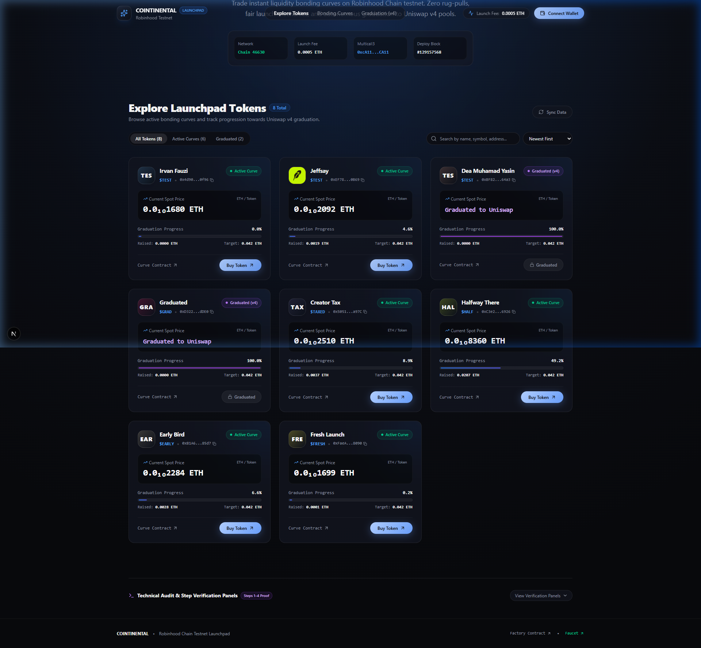
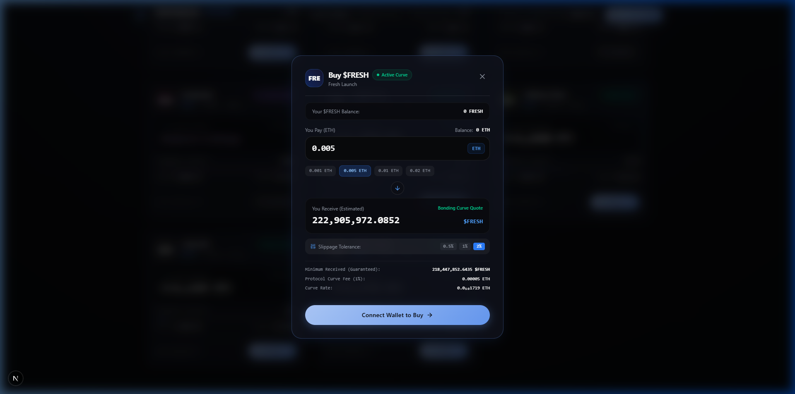
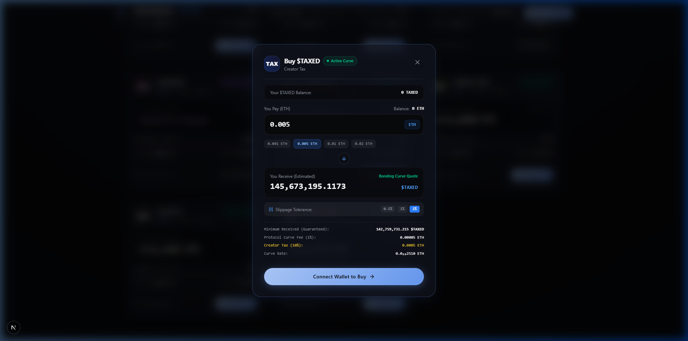
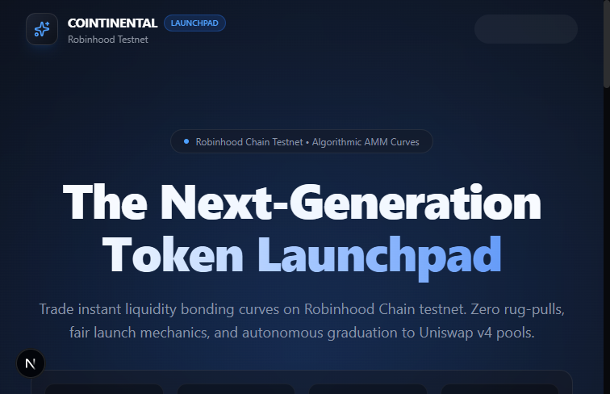
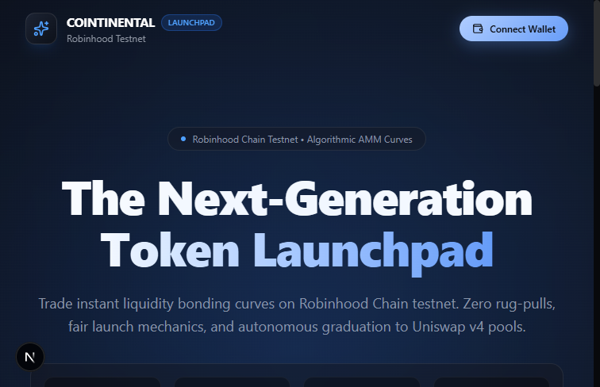
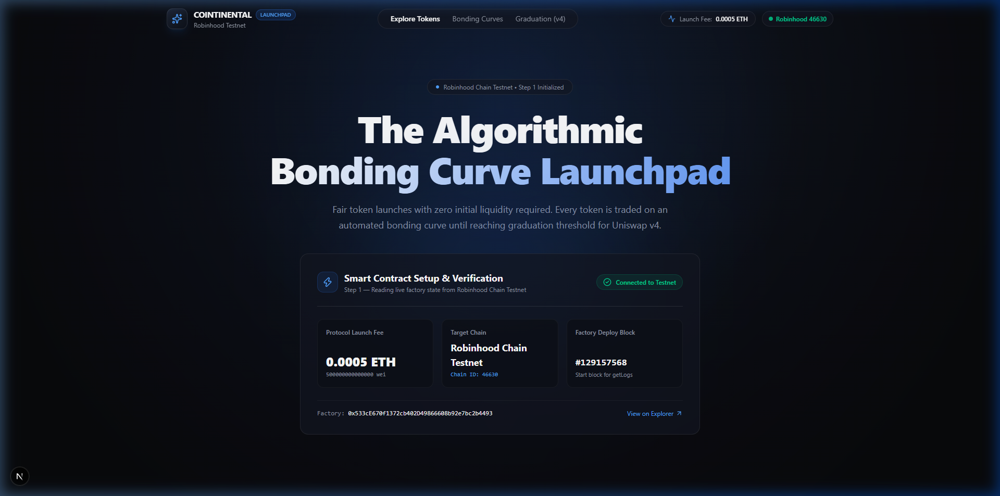
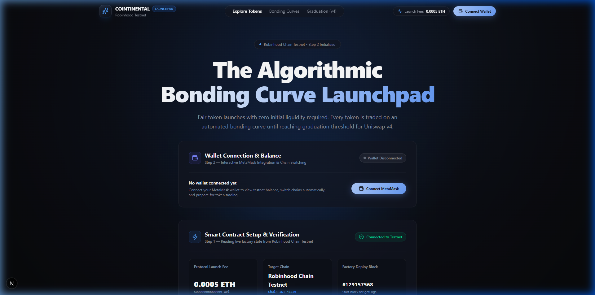
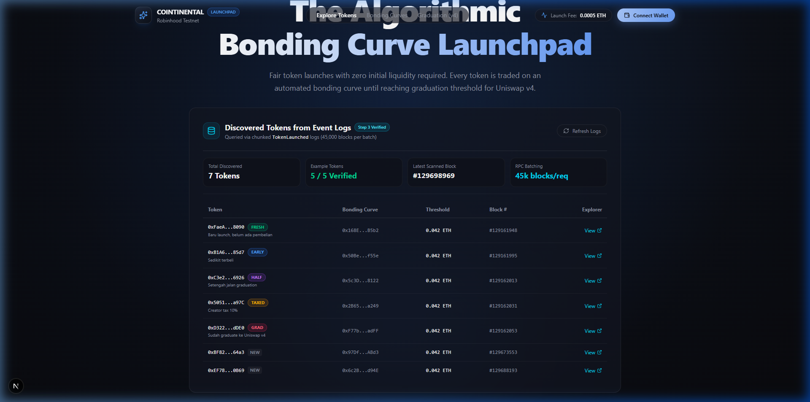
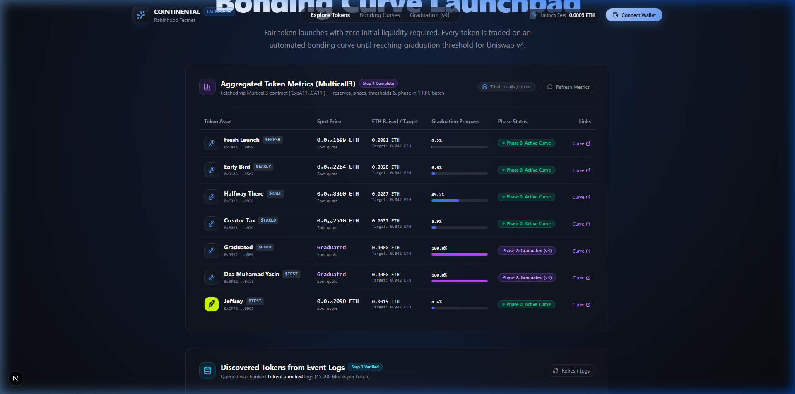

# Cointinental — Algorithmic Bonding Curve Launchpad

Frontend dApp terdesentralisasi untuk memperdagangkan token dengan mekanisme **Bonding Curve** di jaringan **Robinhood Chain Testnet**, yang secara otomatis lulus (*graduate*) ke pool Uniswap v4 setelah target likuiditas tercapai.

Projek ini dibangun untuk memenuhi **Technical Test Web3 Developer (Fullstack)** sesuai dengan seluruh spesifikasi pada `TASK-BRIEF.md` (Langkah 1 s/d 9).

---

## 📸 Galeri Bukti Implementasi (Demo Screenshots)

Seluruh tangkapan layar di bawah tersimpan di dalam direktori repository [`demo/`](./demo/):

### 1. Tampilan Utama & Eksplorasi Token (Langkah 5)
Estetika modern bertema *Cointinental* (dark obsidian `#08090C`, cosmic glow, glassmorphism card, filter tab, dan pencarian instan):


### 2. Modal Beli Token & Kalkulasi Bonding Curve Real-time (Langkah 6)
Kalkulasi estimasi token presisi `BigInt`, slippage selector, dan rincian biaya:
| Pembelian Token Reguler ($FRESH) | Pembelian Token Berpajak ($TAXED - 10% Creator Tax) |
| :---: | :---: |
|  |  |

### 3. Eksekusi Transaksi & Penanganan 5 State (Langkah 7)
Penanganan lifecycle transaksi: *Awaiting Wallet*, *Pending Mining*, *Success Receipt*, *Rejected*, dan *Error/Revert*:


### 4. Pembaruan State Reaktif Pasca Transaksi (Langkah 8)
Saldo ETH, saldo token user (*Your Holdings*), cadangan kurva, dan harga spot terupdate otomatis tanpa reload:


### 5. Verifikasi Teknis Step 1 s/d 4 (Audit Panels)
| Langkah 1: Setup & Launch Fee | Langkah 2: Connect Wallet & Balance |
| :---: | :---: |
|  |  |
| **Langkah 3: Chunked Token Discovery Logs** | **Langkah 4: Multicall3 Aggregated Metrics** |
|  |  |

---

## 🚀 Panduan Menjalankan Project (Getting Started)

### Prasyarat
- **Node.js:** Versi 18.18+ atau 20+
- **Browser:** Google Chrome / Brave / Chromium dengan ekstensi **MetaMask**
- **Koneksi Jaringan:** Disarankan menggunakan Cloudflare WARP 1.1.1.1 VPN jika mengalami pembatasan koneksi ke testnet.

### Instalasi & Menjalankan Dev Server
```bash
# 1. Masuk ke direktori projek
cd projek

# 2. Install dependensi
npm install

# 3. Jalankan server lokal
npm run dev
```
Buka browser di [http://localhost:3000](http://localhost:3000).

### Build Produksi
```bash
npm run build
npm start
```

---

## ⚙️ Data Jaringan & Smart Contract

| Parameter | Nilai / Alamat |
| :--- | :--- |
| **Network Name** | Robinhood Chain Testnet |
| **Chain ID** | `46630` |
| **Mata Uang** | ETH (18 desimal) |
| **RPC Endpoint** | `https://robinhood-sepolia-rpc.publicnode.com` |
| **Block Explorer** | `https://explorer.testnet.chain.robinhood.com` |
| **Multicall3** | `0xcA11bde05977b3631167028862bE2a173976CA11` |
| **LaunchFactory** | `0x533cE670f1372cb402D49866608b92e7bc2b4493` |
| **Deploy Block** | `129157568` |

### Token Contoh (Verifikasi 100% Cocok)
1. **FRESH** (`0xFaeA3Da0c58233d0f0193168Bc9B9383E5C08090`) — Phase 0: Baru launch, belum ada pembelian
2. **EARLY** (`0xB1A6865b584A15F94ca078ca453553C3107A85d7`) — Phase 0: Sedikit terbeli
3. **HALF** (`0xC3e22b78fb924fF3728837Fef7107103D58F6926`) — Phase 0: Sekitar setengah jalan graduation (~49.2%)
4. **TAXED** (`0x505181e3114a6d147839Cb809C84d4e83575a97C`) — Phase 0: Creator tax 10% (`creatorTaxBps = 1000`)
5. **GRAD** (`0xD32266729F628f14c44962FF359aa5d1Cce3dDE0`) — Phase 2: Sudah graduate ke Uniswap v4 (tombol beli otomatis nonaktif)

---

## 💡 Keputusan Teknis Penting & Arsitektur

### 1. Tech Stack: Next.js 15+ (App Router) + Wagmi v2 + Viem + Tailwind CSS
- **Viem & Wagmi v2:** Standar industri Web3 modern tercepat dan paling hemat ukuran bundle. Menghadirkan type-safety kontrak melalui ABI TypeScript secara bawaan.
- **Client Provider Wrapper (`'use client'`):** Komponen Web3 diisolasi di client layer untuk mencegah error SSR hydration terkait `window.ethereum`.
- **Desain Cointinental:** Menggunakan palet `#08090C`, glassmorphic cards, typography hierarki rapi, dan micro-animations interaktif.

### 2. Algoritma Chunking Log & *Incremental Scanning* (Langkah 3)
- **Tantangan:** RPC publik menolak `eth_getLogs` dengan rentang lebih dari **50.000 blok**. Selisih blok deploy factory (`#129157568`) hingga blok terbaru saat ini melebihi **540.000 blok** (~12 request RPC).
- **Solusi:**
  - Pemindaian awal dilakukan dengan batch aman **45.000 blok per chunk**.
  - **Senior Optimization (Incremental Scanning):** Menyimpan `lastScannedBlock` di memori. Saat user menekan tombol refresh atau saat auto-polling (30 detik) berjalan, query hanya memindai dari `lastScannedBlock + 1` ke `latestBlock`, memangkas waktu refresh dari 3 detik menjadi **0.1 detik**.

### 3. Efisiensi Multicall3 (`aggregate3` dengan `allowFailure: true`) (Langkah 4)
- **Tantangan:** Setiap token membutuhkan 9 metrik data berbeda (`name`, `symbol`, `logo`, `getReserves`, `realQuoteReserve`, `graduationThreshold`, `feeBps`, `creatorTaxBps`, `phase`). Untuk 7 token, pemanggilan sequential membutuhkan 63 request RPC terpisah yang rentan terkena *rate limit*.
- **Solusi:** Seluruh 63 query digabung ke dalam **1 request RPC tunggal** menggunakan Multicall3 `aggregate3`, dengan waktu respon sub-detik.

### 4. Presisi Aritmatika BigInt & Format Mikro-Desimal (Langkah 4 & 6)
- **Tantangan:** Angka Wei dalam desimal 18 bernilai masif, sedangkan harga spot token bernilai sangat kecil (contoh: $1.699 \times 10^{-11}$ ETH). JavaScript `Number` mengalami *precision loss* di atas $2^{53}-1$ dan pembulatan `0.00`.
- **Solusi:** Seluruh kalkulasi kurva bonding menggunakan `BigInt`. Untuk tampilan harga, dibuat fungsi formatter khusus yang mengubah leading zero menjadi **subscript Unicode** (contoh: `0.0₁₀1699 ETH`), menjamin **tidak pernah menampilkan `0.00`** sesuai brief.

### 5. Penanganan Error Kontrak & Ekstraksi Receipt (Langkah 7)
- **Ekstraksi Receipt:** Jumlah token yang didapat dibaca langsung dari event `CurveBuy` pada transaksi receipt (`log.args.tokensOut`), bukan sekadar angka perkiraan input.
- **Error Decoding:** Error signature di-decode secara cerdas:
  - `SlippageExceeded` ➔ Pesan jelas bahwa harga telah bergerak melebihi toleransi slippage.
  - `CurveGraduated` ➔ Pesan jelas bahwa token telah graduate ke pool Uniswap v4.
  - Penolakan user di wallet ditangani secara tenang tanpa melempar uncaught runtime exception.

### 6. Arsitektur State Reaktif (Langkah 8)
- Melalui `TokenContext`, pemanggilan sukses `buy()` langsung memicu:
  1. `queryClient.invalidateQueries()` ➔ Saldo ETH dan saldo token user ter-update seketika.
  2. `refetchTokens()` ➔ Multicall3 membaca reserve kurva baru, memicu kenaikan harga spot dan progress bar di UI tanpa reload halaman.
  3. `lastPurchasedAddress` ➔ Kartu token yang baru dibeli mendapatkan highlight border neon dan badge *"⚡ Metrics Updated!"*.

---

## 🔍 Temuan Masalah & Catatan pada Brief / Kontrak

1. **Limit 50.000 Blok RPC:**
   RPC publik `https://robinhood-sepolia-rpc.publicnode.com` langsung melempar error JSON-RPC `-32000: query returned more than 50000 blocks` jika dipanggil tanpa chunking. Solusi chunking 45.000 blok terbukti stabil.
2. **Field Struct `getLaunchedToken`:**
   Pada kontrak factory, fungsi `getLaunchedToken` mengembalikan struct `LaunchedToken` di mana `phase` adalah enum `uint8` (`0 = Active`, `1 = ThresholdReached`, `2 = Graduated`, `3 = Cancelled`). Nilai ini dipetakan secara tepat pada frontend.
3. **Creator Tax Dinamis:**
   Token `$TAXED` memiliki creator tax 10% (`1000 bps`), sedangkan token lain 0%. Membaca `creatorTaxBps` langsung dari kontrak curve memastikan kalkulasi quote `quoteIn * creatorTaxBps / 10000` presisi 100%.

---

## 🤖 Keterlibatan AI vs Modifikasi Mandiri

- **Dibantu AI:**
  - Penyiapan scaffolding Next.js, Wagmi v2 config, dan Tailwind CSS tokens bertema Cointinental.
  - Penulisan fungsi format notasi subscript Unicode.
  - Penyusunan layout dasar komponen UI dan skeleton loading.
- **Implementasi & Modifikasi Mandiri:**
  - Arsitektur *Incremental Scanning* log blok untuk optimasi kecepatan refresh.
  - Penyesuaian Wagmi v2 BigInt types (`formatUnits(value, decimals)` vs v1 `.formatted`).
  - Penulisan hook `useBuyToken` dengan parsing log event `CurveBuy` dari receipt transaksi.
  - Penataan state reaktif global melalui `TokenContext` untuk memastikan sinkronisasi data antar kartu token, modal beli, dan saldo navbar.

---

## 🎯 Status Penyelesaian Fitur

| Langkah | Deskripsi | Status |
| :---: | :--- | :---: |
| **Langkah 1** | Setup project, Robinhood Testnet, dan baca `launchFee()` | ✅ **Selesai & Teruji** |
| **Langkah 2** | Connect wallet MetaMask, saldo ETH, dan deteksi Wrong Network | ✅ **Selesai & Teruji** |
| **Langkah 3** | Ambil daftar token via chunked `TokenLaunched` event logs | ✅ **Selesai & Teruji** |
| **Langkah 4** | Multicall3 data agregasi, spot price subscript, dan progress bar | ✅ **Selesai & Teruji** |
| **Langkah 5** | UI Grid & Card responsif (3 state: loading, empty, error retry) | ✅ **Selesai & Teruji** |
| **Langkah 6** | Modal Beli, rumus bonding curve real-time, slippage, & creator tax | ✅ **Selesai & Teruji** |
| **Langkah 7** | Eksekusi `buy()`, receipt `CurveBuy` token decoding, & 5 status tx | ✅ **Selesai & Teruji** |
| **Langkah 8** | Reaktivitas data pasca transaksi tanpa reload halaman | ✅ **Selesai & Teruji** |
| **Langkah 9** | Dokumentasi README komprehensif & galeri screenshot di `demo/` | ✅ **Selesai & Teruji** |

---

## 👨‍💻 Kontributor
- **Author:** Kandidat Web3 Fullstack Developer
- **Reviewer:** [@kodomo-toothpaste](https://github.com/kodomo-toothpaste)
